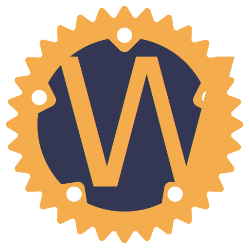

#  dark-iron-rs
> *"I can imagine no way in which this thing could be considered anywhere remotely close to safe. All I know is I spent six hours in there and I'm still alive... You still want to do it?"*

an attempt to port some of my code from 3.3.5a to 1.12.1

## building

```sh
$ git clone https://github.com/fitzdotlol/dark-iron-rs
$ cd dark-iron-rs
$ cargo build
```
